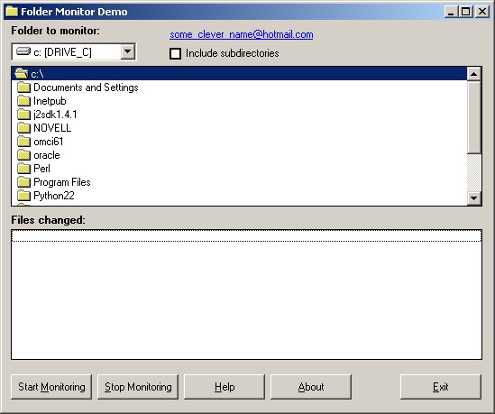



## Folder Monitor

### Description

Folder Monitor is a class written in Visual Basic 6.0 that monitors changes made to files in a specified directory (folder) or directories (folders) and its subdirectories (subfolders). It uses the Windows API functions WaitForMultipleObjects, FindFirstChangeNotification, FindNextChangeNotification, and FindCloseChangeNotification.
 
### More Info
 
Okay, sorry about the MSI (Microsoft Installer) package. Geez, what happened to the days where you could trust people? The code is repackaged in a zip - no executables. This is my first contribution here (and thanks to some of the smart _ss comments, perhaps my last). This demo was not originally put together for distribution on PSC.

             |
---                |---
**Submitted On**   |2002-12-23 22:28:54
**By**             |[Darrell Koller](https://github.com/Planet-Source-Code/PSCIndex/blob/master/ByAuthor/darrell-koller.md)
**Level**          |Advanced
**User Rating**    |5.0 (30 globes from 6 users)
**Compatibility**  |VB 6\.0
**Category**       |[Files/ File Controls/ Input/ Output](https://github.com/Planet-Source-Code/PSCIndex/blob/master/ByCategory/files-file-controls-input-output__1-3.md)
**World**          |[Visual Basic](https://github.com/Planet-Source-Code/PSCIndex/blob/master/ByWorld/visual-basic.md)
**Archive File**   |[Folder\_Mon15179312242002\.zip](https://github.com/Planet-Source-Code/darrell-koller-folder-monitor__1-41816/archive/master.zip)

